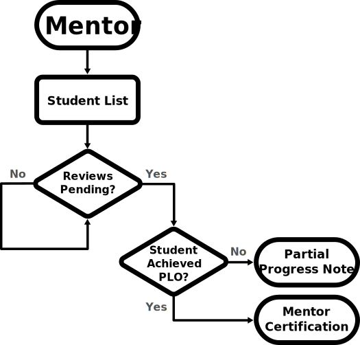

# Mentor

The mentor begins the flow with a list of students (presented in a similar way to the student's list of competencies). It will be easy for them to see any potential pending mentor reviews that need action.

They can open any of these pending competencies to either mark them with partial progress or with certification, depending on whether they feel that the student has demonstrated the competency in question.

