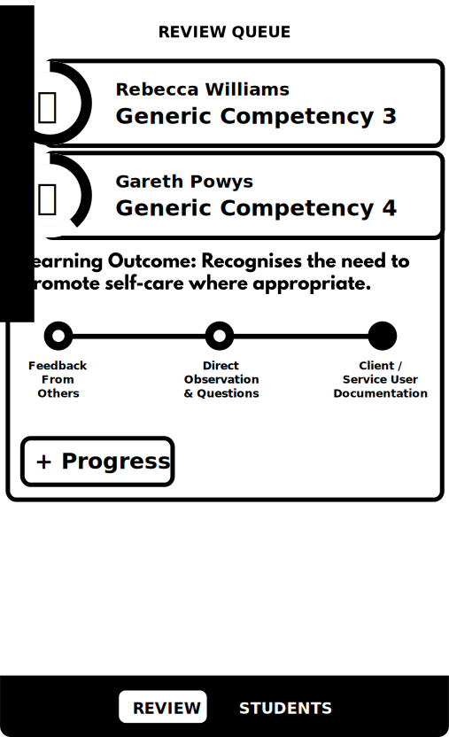

# Mentor Review

The mentor review screen is the home screen that mentors will return to in order to see which students have marked competencies for mentor review.

Above is a wireframe which describes the required elements for the mentor's home screen.

## Review Queue
The primary focus is the review queue which is a list of learning outcomes that students feel they have achieved. The mentor can expand any review item to mark progress towards a given goal. 

Each review item is made up of there main components.

### Title & Name
Each review item has a clear title which includes the name of the learning outcome, the competency, and the name of the student.

### Avatar & Review
At the left is an avatar surrounded by a progress meter. This will help mentors gauge the overall progress of the student and also uniquely identify the student at a glance.

### Expanded Overview
Again, each item can be expanded to show the levels for the competency. The mentor will be able to see which ones have already been marked as marked by the student and which have already been certified by the mentor. The mentor will be able to select the ones marked by the student to certify them. The mentor will be able to cancel if they accidentally certify the incorrect Learning Outcome.

## Navigation
Finally there is a constant navigation control which allows mentors to transition from this screen to the [mentor student list screen](mentor-students.html).

