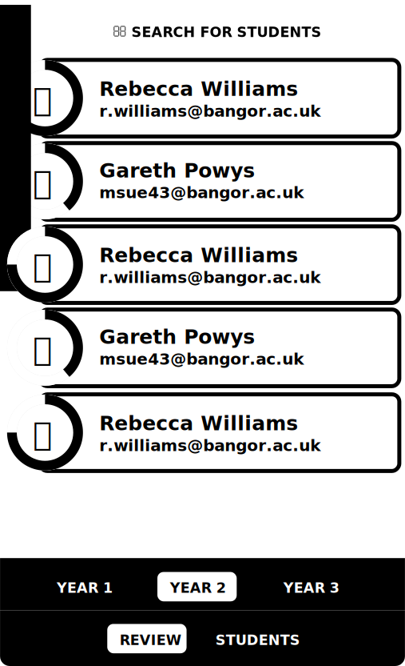

# Mentor Student List

The mentor review screen is the secondary screen that mentors will return to in order to see a complete list of students.

Above is a wireframe which describes the required elements for the mentor's student screen.

## Student List
The primary focus is the student list, which lists all of the students in a given year. The list is made up of student items which display the student's overall progress, along with their avatar, name and contact details.

## Filter
This component enhances the existing navigation to allow mentors to filter the list of students they see by their year.

## Navigation
Finally there is a constant navigation control which allows mentors to transition from this screen to the [mentor review queue](mentor-dashboard.html).

