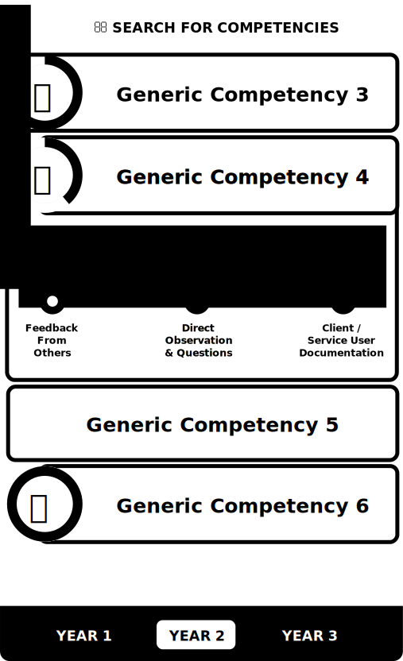

# Student Dashboard

The student dashboard is the home screen that the student will return to in order to check the state of their achievements across the various competencies.

Above is a wireframe which describes the required elements for the student's home screen or _dashboard_.

## Competency List
The primary focus is the list of competencies that occupy the main part of the screen. Each one is composed of three main components.

### Title
Each competency has a clear title, which the student can search against.

### State Indicator
At the left is a progress indicator which is only present if the user has started or completed a given competency.

### Expanded Overview
A competency can be expanded to show the overview text for that specific learning outcome, as well as a visual representation of the progress across the specific levels required.

A user can tap or click on one of these levels to mark it for mentor review. Once marked for mentor review the visual state of the level will change and when a mentor marks it as complete it will change again.

## Search
A portion of the screen will be reserved for allowing the student to run a text based search for a given competency. This will reduce the list of competencies shown on screen based on the search criteria.

## Filtering
The bottom of the screens shows filtering controls that will allow a student to see the competencies from a specific year. This will provide them with insight as to what's still to come from future placements. It will also allow second and third year students to look back at their previous placements. 

