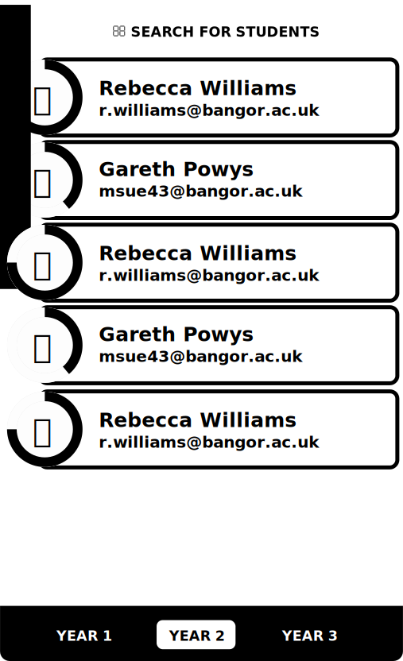

# Tutor Dashboard

The tutor home screen is the home screen that tutors use to search for their students and understand what their current progress is towards their practice competancies. 

Above is the wireframe which describes the required elements for the tutor's home screen or _dashboard_.

This screen works in the same way as the [mentor student list](mentor-students.html), except it doesn't need to provide navigation to the review queue, so that component is omitted.
